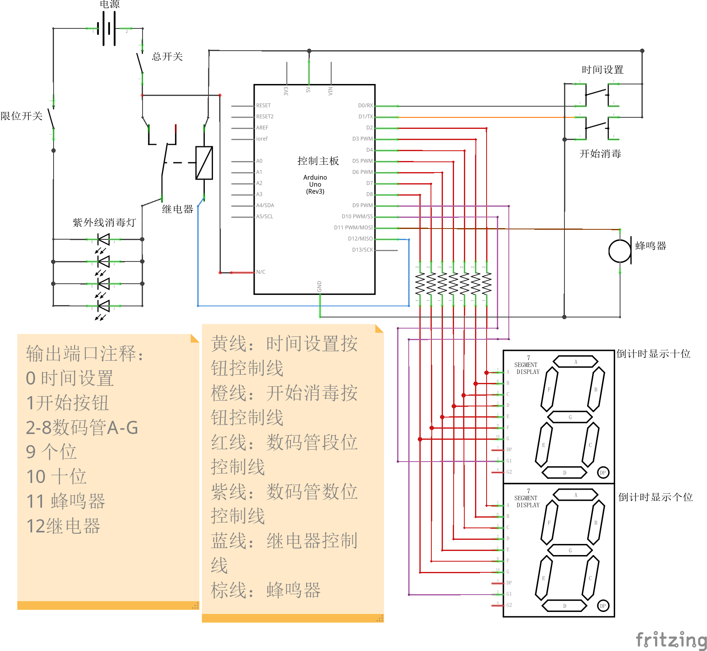

# 2021-2022春季工程实践项目代码部分

在线模拟请点击：[项目模拟](https://www.tinkercad.com/things/1ofEXL1rRSD?sharecode=d6FXWozihOoVmz8GcI04vhIzTD1VdvqPPDobaGMrmm8)。

# 程序说明：

## 程序功能：

简单的计时器的实现，同时融合了警示灯和倒计时结束的警示铃声的功能。

## 接线方式：
0-增加时间按钮：按下此按钮后，消毒时间增加五分钟

1-消毒开始/暂停按钮：按下此按钮后，消毒步骤开始或终止

2~8-数码管口：分别对应A至G，两数码管同名阴极以并联方式连接，注意电阻

9~10-数码管阳极口：9对应个位数数码管；10对应十位数数码管

11-蜂鸣器阳极口

12-继电器口

13-led口：该灯在消毒时亮起，不消毒时灭；实际产品没有这部分，仅用于调试和演示效果使用

## 需要注意：
1. 程序调试时，应该打开led接口便于观察效果，建议将**倒计时**部分时间差值改为1000方便演示
2. 实际工作时，led灯的相关代码**需要被注释掉**，并且注意**时间差值要设置为60000** *（按照分钟计时）*

# 免责声明：

本项目遵循**MIT LICENSE**协议。
# 红线接地，棕线5V
